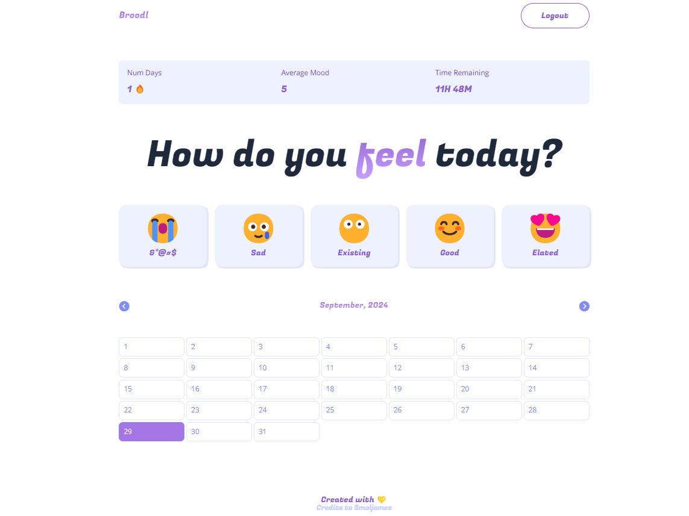

# Mood Tracking App 

 

A mood tracking application bulit as an attempt to learn full-stack development 

--------

 

  

## Features

The App allows users to:
- Enter and record their daily moods
- View their mood history over time
- Gain insights into their emotional patterns
